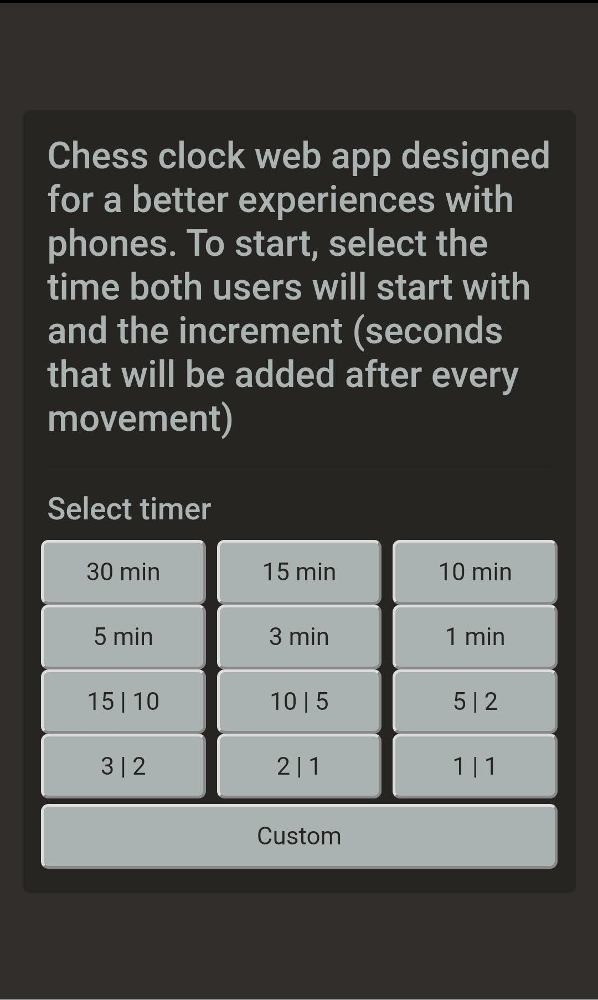

### Chess clock web app
Chess clock web app designed for a better experience with phones. To start, select the time both users will start with and the increment (seconds that will be added after every movement).

Once you have selected the time and increment, the game will start.

This web app was designed to use it for free without downloading any app.

## Code
This app has been developed with React, using Typescript and SaSS mainly.